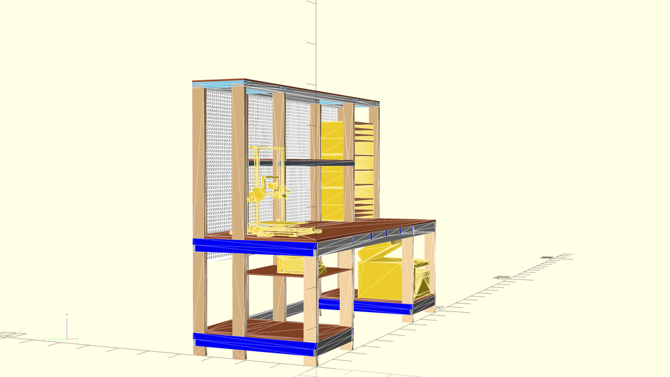
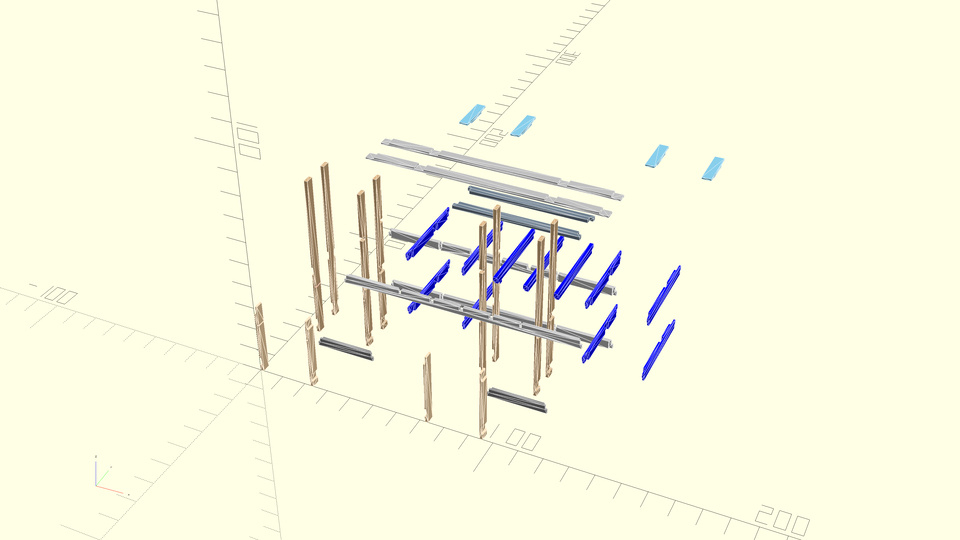
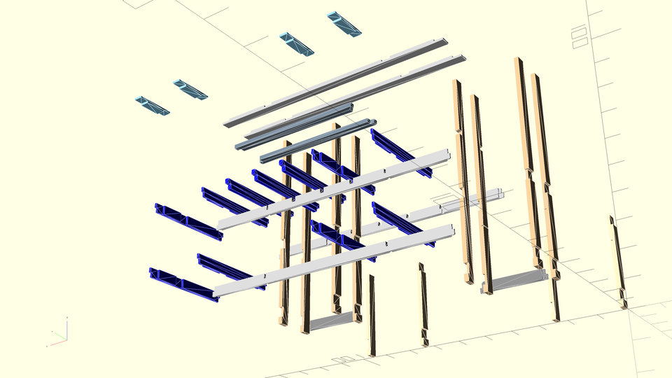
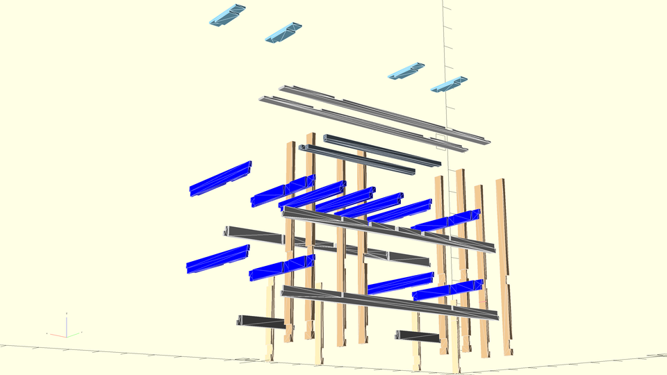
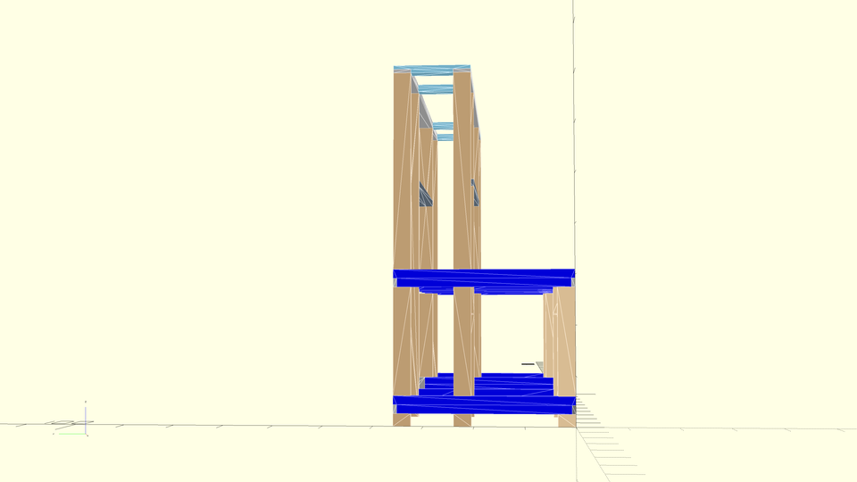

# openscad-workbench-design

Openscad designs for my new workbench. This has been _very_ specifically sized to fit certain items.

## ToDo

* Rotate supports for top shelf to give more vertical space?
* Adjustable shelves in opening on right side of hutch. Will need another set of vertical 2x4s in-between the rear and center ones on this side, for nailing surface. Shelves would be supported by either sliding into full-depth grooves in boards fastened to either side of the opening, or a similar system using 3d printed plastic holders. While it would take a LONG time, I should be able to print the needed supports on my Creality CR-10S 3d printer; they'd have a footprint of approximately 10-12" (254-305mm) square when printed, and when installed would just be stacked vertically one over another to make the full height.
  * The shelves themselves would be either [1/8" MDF](https://www.homedepot.com/p/Hardboard-Tempered-Panel-Common-1-8-in-4-ft-x-8-ft-Actual-0-115-in-x-47-7-in-x-95-7-in-832777/202189720) or [1/4" MDF](https://www.homedepot.com/p/Medium-Density-Fiberboard-Common-1-4-in-x-2-ft-x-4-ft-Actual-0-216-in-x-23-75-in-x-47-75-in-1508104/202089069) and would ideally be adjustable in 1/4" or 1/2" increments.

## Rendered Images

## Parts List

* 5x 2x4x8' - long horizontal struts
* 10x 2x4x6' - 8x rear and center legs; 2x hutch shelf supports
* 4x 2x4x31" - front legs
* 2x 2x4x2' - Lower front side horizontal struts
* 11x 2x4x3' - Depth-wise horizontal supports
* 4x 2x4x1' - Upper shelf supports
* 1x 8'x3' 3/4" MDF - desktop
* 1x 6'x1' 1/2" MDF - hutch shelf
* 1x 8'x1' 1/2" MDF - upper shelf
* 2x 2'x3' 1/2" MDF - lower shelves
* 1x 23"x24" 1/4" MDF or plywood - left side shelf under desktop
* 1x 4'x8' pegboard, such as [this](https://www.homedepot.com/p/Pegboard-White-Panel-Common-3-16-in-x-4-ft-x-8-ft-Actual-0-155-in-x-47-7-in-x-95-7-in-486140/202189722)

## Materials List

**Note:** The 1/2" MDF will fit exactly on one panel if we exclude kerf. That's what I've done, assuming the half-kerf short side will just be put on the back.

* 23x 2x4x8'
* 1x 4'x8'x3/4" MDF panel
* 1x 4'x8'x1/2" MDF panel
* 1x 2'x2'x1/4" MDF or plywood panel
* 1x 4'x8' pegboard, such as [this](https://www.homedepot.com/p/Pegboard-White-Panel-Common-3-16-in-x-4-ft-x-8-ft-Actual-0-155-in-x-47-7-in-x-95-7-in-486140/202189722)

## Open questions for OpenSCAD

* How to do an exploded view? Can I configure this via a parameter/variable, so that at the CLI I can render both exploded and non-exploded views?
  * Maybe using [this](https://gist.github.com/damccull/1a1df5e785e56daf53e0d7b7d8ff219e)?
* How can I show measurements/dimensions on a rendered drawing? Do I need to just export it to something else?
* Is there any better way to visualize the intersection between two faces, other than giving the components different colors?

## Notes

### Dependencies

This code currently depends on a few STL files from another repository of mine. Rather than pull in the whole repository, which is quite large, I've included ``get_deps.sh`` which downloads the necessary files from GitHub.

### render function

According to [OpenSCAD User Manual/First Steps/Changing the color of an object - Wikibooks, open books for an open world](https://en.wikibooks.org/wiki/OpenSCAD_User_Manual/First_Steps/Changing_the_color_of_an_object) and [this mailing list post](http://forum.openscad.org/Color-in-Compile-and-Render-mode-tp4637p4639.html), color doesn't work in rendered mode, only preview. That was the case in 2013 and, as far as I can tell, is still the case in 2020. So, we can't use rendered mode, we can only use preview, because the colors are actually important.

However, in preview mode, there are usually serious issues with z-fighting between components. The fix for this seems to be to wrap each component in a [render function](https://en.wikibooks.org/wiki/OpenSCAD_User_Manual/Other_Language_Features#Render).
