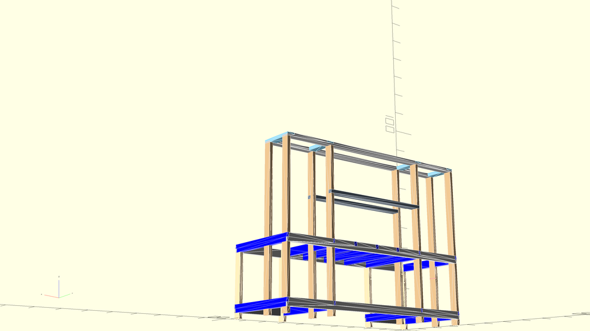

# openscad-workbench-design

Openscad designs for my new workbench. This has been _very_ specifically sized to fit certain items.

## Rendered Images

## Open questions for OpenSCAD

* How to do an exploded view? Can I configure this via a parameter/variable, so that at the CLI I can render both exploded and non-exploded views?
  * Maybe using [this](https://gist.github.com/damccull/1a1df5e785e56daf53e0d7b7d8ff219e)?
* How can I show measurements/dimensions on a rendered drawing? Do I need to just export it to something else?
* Is there any better way to visualize the intersection between two faces, other than giving the components different colors?

## Notes

### render function

According to [OpenSCAD User Manual/First Steps/Changing the color of an object - Wikibooks, open books for an open world](https://en.wikibooks.org/wiki/OpenSCAD_User_Manual/First_Steps/Changing_the_color_of_an_object) and [this mailing list post](http://forum.openscad.org/Color-in-Compile-and-Render-mode-tp4637p4639.html), color doesn't work in rendered mode, only preview. That was the case in 2013 and, as far as I can tell, is still the case in 2020. So, we can't use rendered mode, we can only use preview, because the colors are actually important.

However, in preview mode, there are usually serious issues with z-fighting between components. The fix for this seems to be to wrap each component in a [render function](https://en.wikibooks.org/wiki/OpenSCAD_User_Manual/Other_Language_Features#Render).
