# openscad-workbench-design

Openscad designs for my new workbench. This has been _very_ specifically sized to fit certain items.

## Final Build

There were some changes to the plans in my build. The only ones that are important should be noticeable in the photos.

[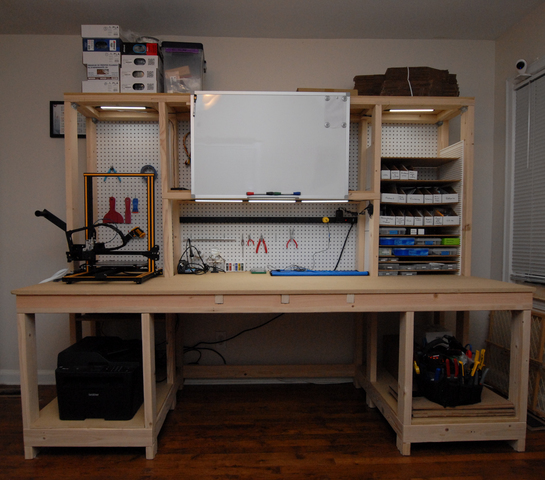](photos/RAW_1958.JPG)

[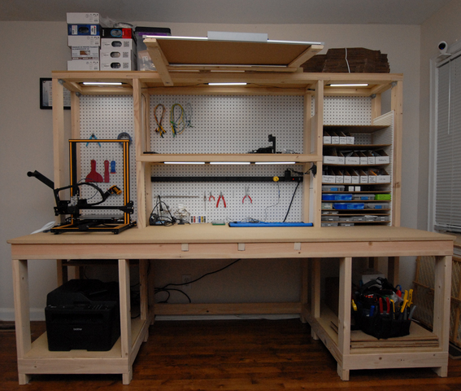](photos/RAW_1959.JPG)

[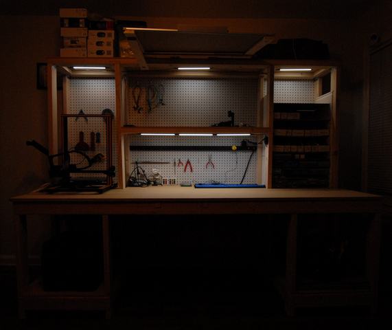](photos/RAW_1960.JPG)

[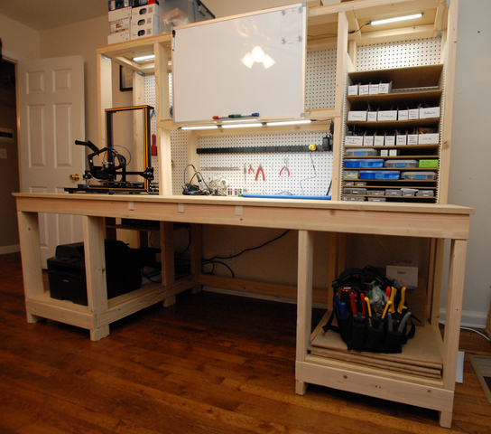](photos/RAW_1964.JPG)

[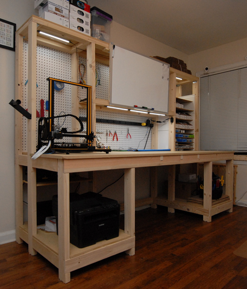](photos/RAW_1965.JPG)

[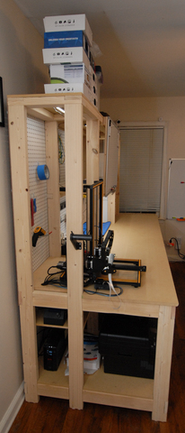](photos/RAW_1967.JPG)

[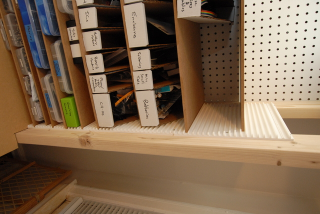](photos/RAW_1962.JPG)

[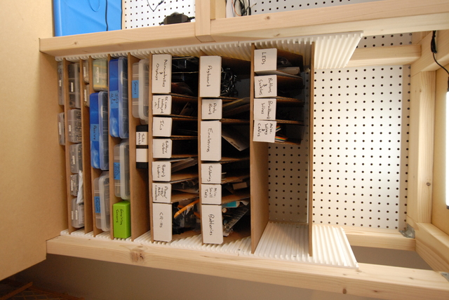](photos/RAW_1963.JPG)

## Rendered Images

[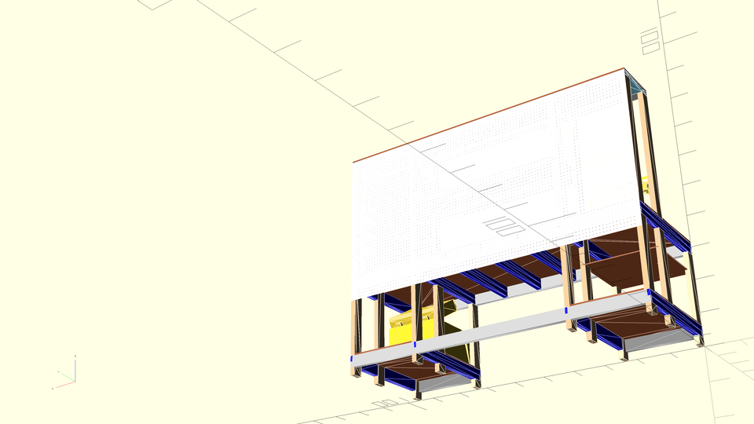](renders/assembled_back_lower.png)

[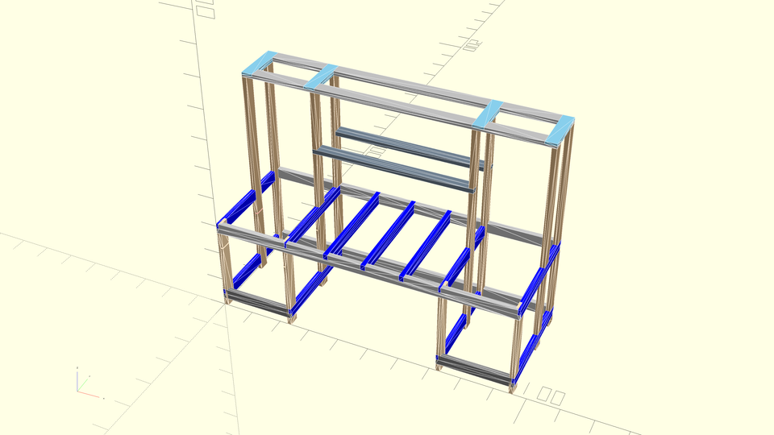](renders/framing_default.png)

[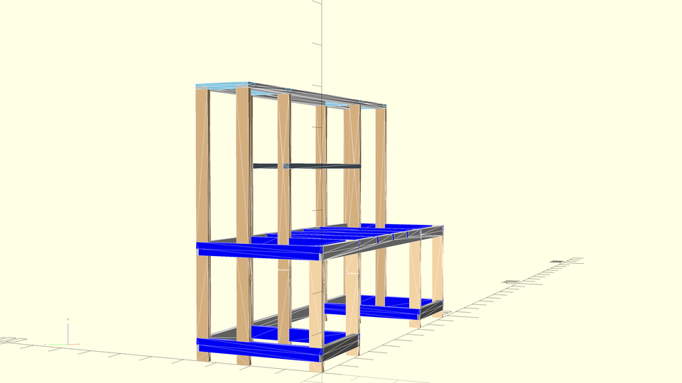](renders/framing_left_oblique.png)

### Shelf Supports

[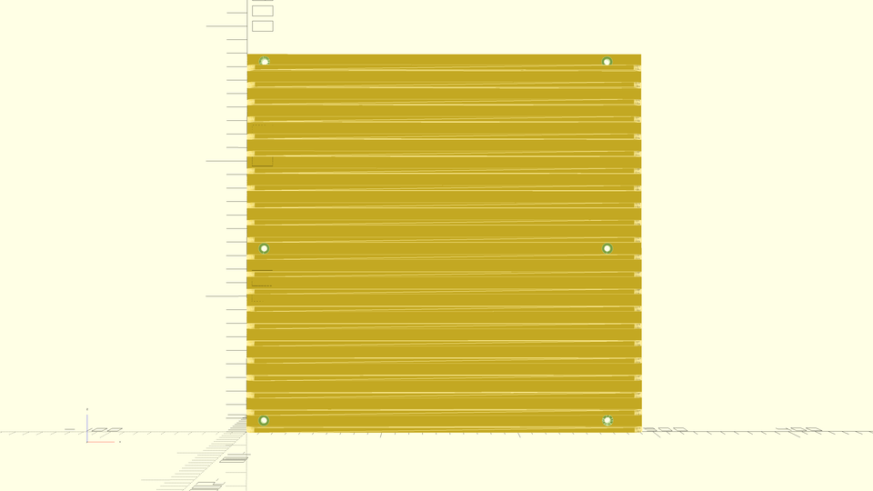](renders/shelf_support_front.png)

[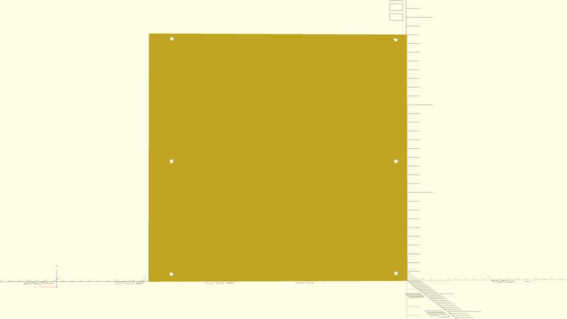](renders/shelf_support_back.png)

[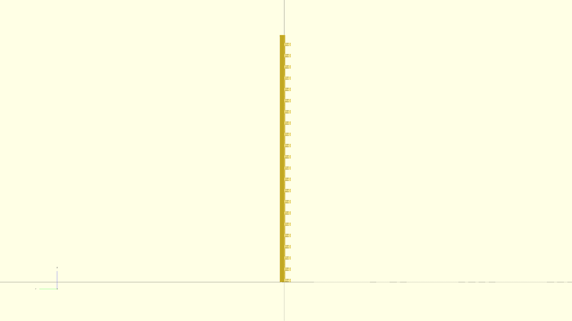](renders/shelf_support_edge.png)

## Parts List

* 5x 2x4x8' - long horizontal plates
* 8x 2x4x6' - rear and center legs
* 2x 2x4x51" - hutch shelf supports
* 4x 2x4x31" - front legs
* 4x 2x4x15.5" - Upper shelf supports
* 2x 2x4x2' - Lower front side short horizontal plates
* 11x 2x4x3' - Depth-wise horizontal supports (3x desktop supports, 8x lower side ties)
* 2x 2'x3' 1/2" MDF - lower shelves
* 1x 51"x15.5" 1/2" MDF - hutch shelf
* 1x 8'x3' 3/4" MDF - desktop
* 1x 8'x15.5" 1/2" MDF - top shelf
* 1x 23"x24" 1/4" MDF or plywood - left side shelf under desktop
* 1x 4'x8' pegboard, such as [this](https://www.homedepot.com/p/Pegboard-White-Panel-Common-3-16-in-x-4-ft-x-8-ft-Actual-0-155-in-x-47-7-in-x-95-7-in-486140/202189722)
* approx. 11x 12"x20.5" shelves made from [1/8" MDF](https://www.homedepot.com/p/Hardboard-Tempered-Panel-Common-1-8-in-4-ft-x-8-ft-Actual-0-115-in-x-47-7-in-x-95-7-in-832777/202189720) or [1/4" MDF](https://www.homedepot.com/p/Medium-Density-Fiberboard-Common-1-4-in-x-2-ft-x-4-ft-Actual-0-216-in-x-23-75-in-x-47-75-in-1508104/202089069) (a 4x8 sheet will make 14 shelves)
* #8 x 3/4" screws for mounting shelf supports

## Materials List

**Note:** The 1/2" MDF will fit exactly on one panel if we exclude kerf. That's what I've done, assuming the half-kerf short side will just be put on the back.

* 23x 2x4x8'
* 1x 4'x8'x3/4" MDF panel
* 1x 4'x8'x1/2" MDF panel
* 1x 2'x2'x1/4" MDF or plywood panel
* 1x 4'x8' pegboard, such as [this](https://www.homedepot.com/p/Pegboard-White-Panel-Common-3-16-in-x-4-ft-x-8-ft-Actual-0-155-in-x-47-7-in-x-95-7-in-486140/202189722)
* 1x 4'x8' [1/8" Hardboard](https://www.homedepot.com/p/Hardboard-Tempered-Panel-Common-1-8-in-4-ft-x-8-ft-Actual-0-115-in-x-47-7-in-x-95-7-in-832777/202189720) or [1/4" MDF](https://www.homedepot.com/p/Medium-Density-Fiberboard-Common-1-4-in-x-2-ft-x-4-ft-Actual-0-216-in-x-23-75-in-x-47-75-in-1508104/202089069)

## Dimensional Drawings for Fabrication and Assembly

These are tough. In short, the only way OpenSCAD can dimension drawings is if you draw, and locate, every line, arrow, and piece of text in 3D space just like any other part. I didn't know that until I'd done most of the work on this design, so I just threw in the towel on it.

[build.py](build.py) (see more below) will create ``individual_components/`` as a directory full of full-page (US Letter / 8.5x11") per-component drawings, each page containing the name, quantity, and views of all six sides. Dimensions must be added by hand, if needed. It will also create three exploded views of the framing. Because of the very poor "exploding" used, and the large number of parts, there are three exploded diagrams each showing one level of horizontal supports.

**To print** the diagrams, ensure LP is set up (``lpoptions -d PrinterName`` to set the default printer) and then just ``lp individual_components/*.png`` Since the images are already sized for the printer resolution and paper size, no scaling is needed.

## Notes

### Built Images

Running [build.py](build.py) will regenerate all rendered images in [renders/](renders/) as well as generating printable per-component views and some printable exploded diagrams (each containing a subsection of the full project, for ease of use).

### Dependencies

This code currently depends on a few STL files from another repository of mine. Rather than pull in the whole repository, which is quite large, I've included ``get_deps.sh`` which downloads the necessary files from GitHub.

### render function

According to [OpenSCAD User Manual/First Steps/Changing the color of an object - Wikibooks, open books for an open world](https://en.wikibooks.org/wiki/OpenSCAD_User_Manual/First_Steps/Changing_the_color_of_an_object) and [this mailing list post](http://forum.openscad.org/Color-in-Compile-and-Render-mode-tp4637p4639.html), color doesn't work in rendered mode, only preview. That was the case in 2013 and, as far as I can tell, is still the case in 2020. So, we can't use rendered mode, we can only use preview, because the colors are actually important.

However, in preview mode, there are usually serious issues with z-fighting between components. The fix for this seems to be to wrap each component in a [render function](https://en.wikibooks.org/wiki/OpenSCAD_User_Manual/Other_Language_Features#Render).
